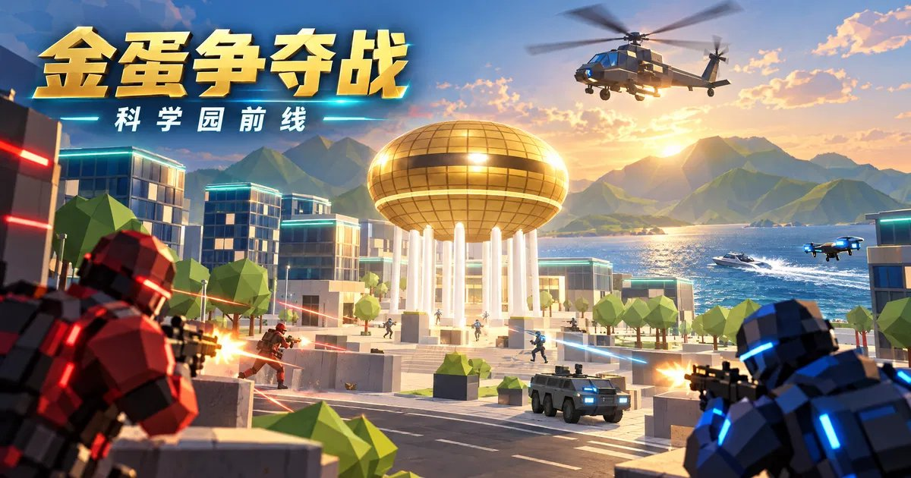
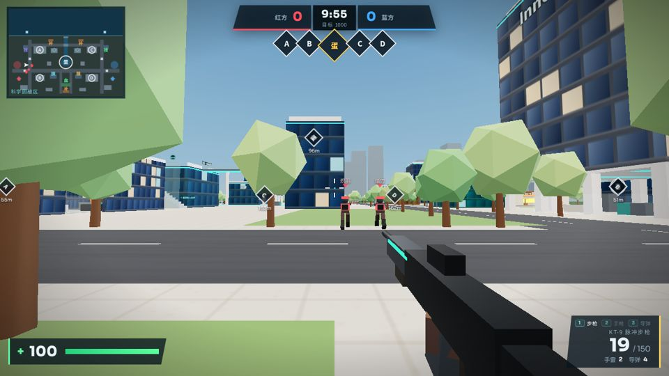
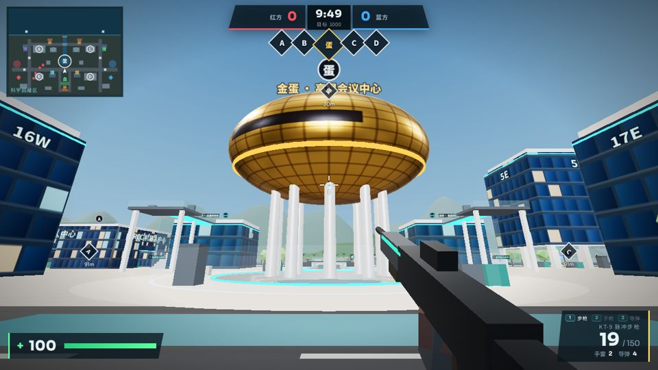
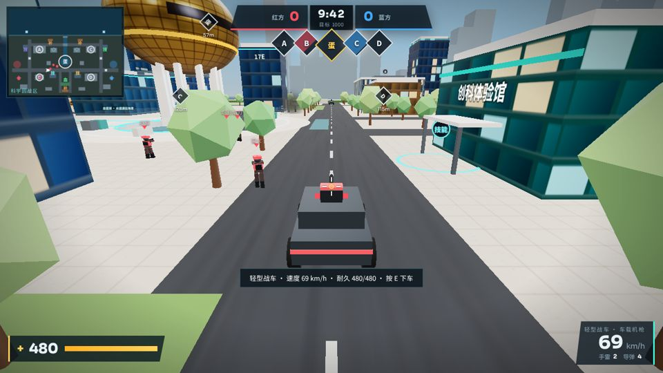
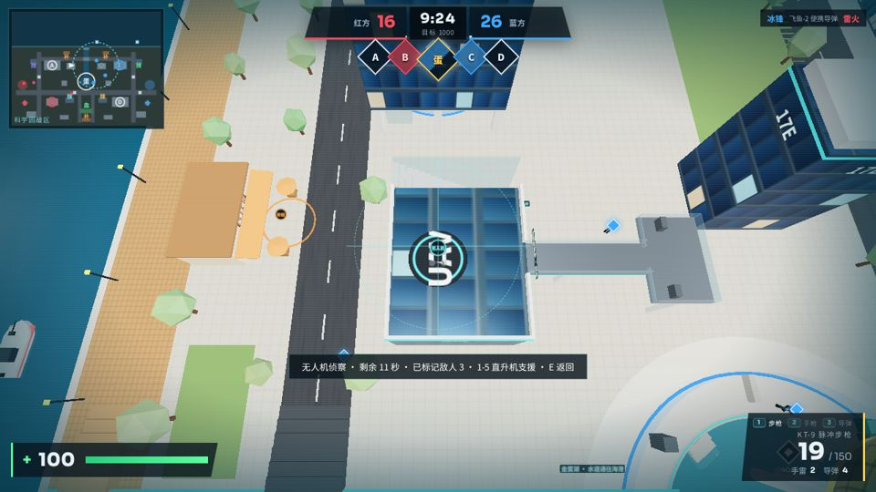
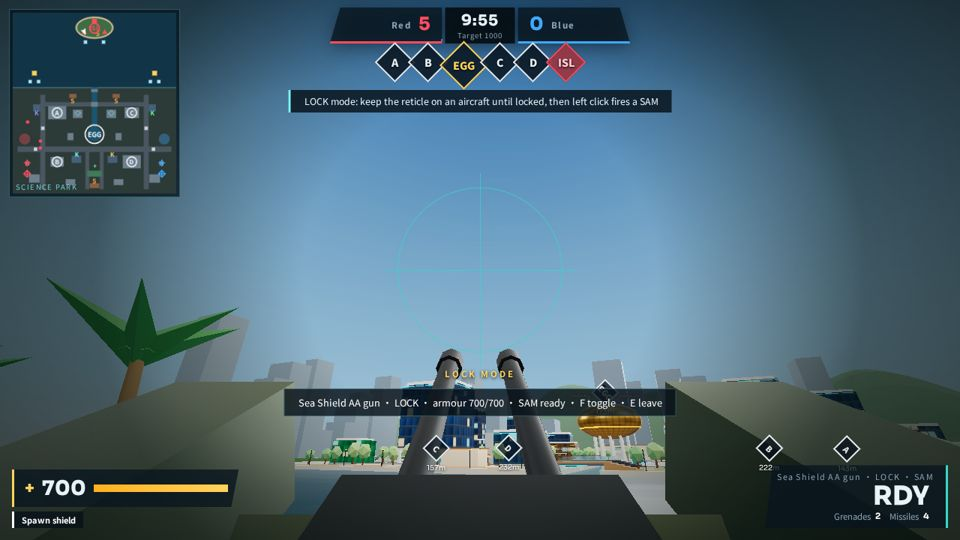
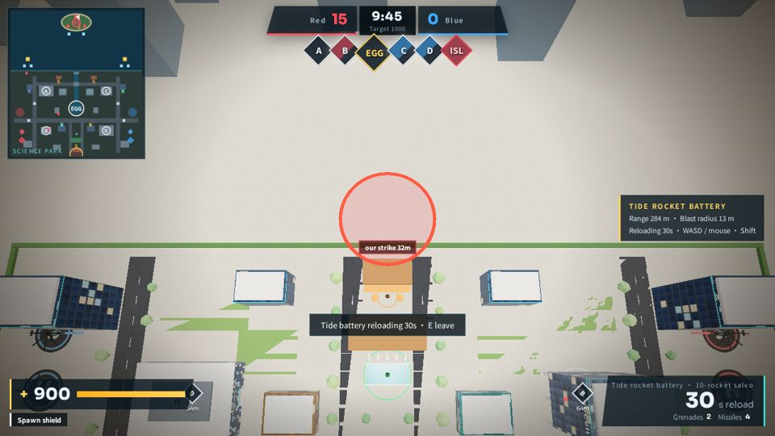
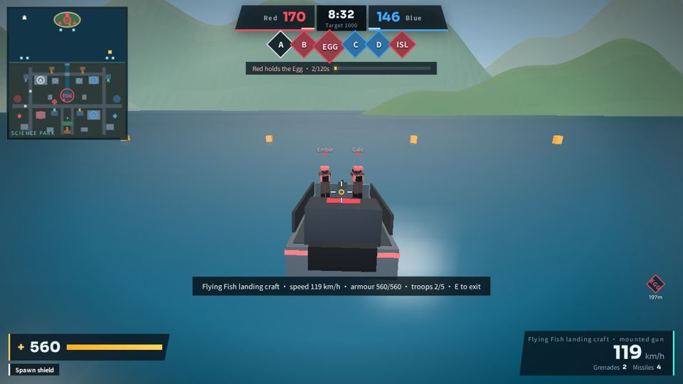
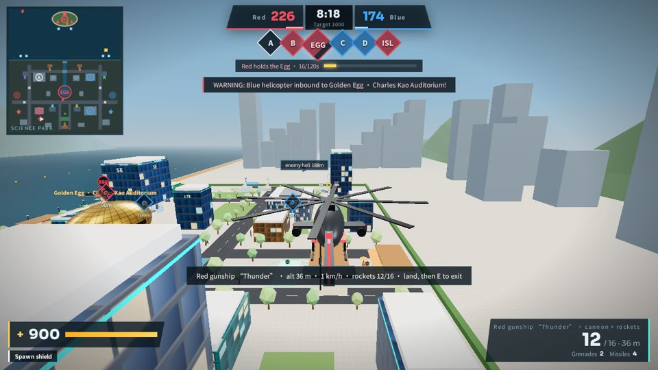
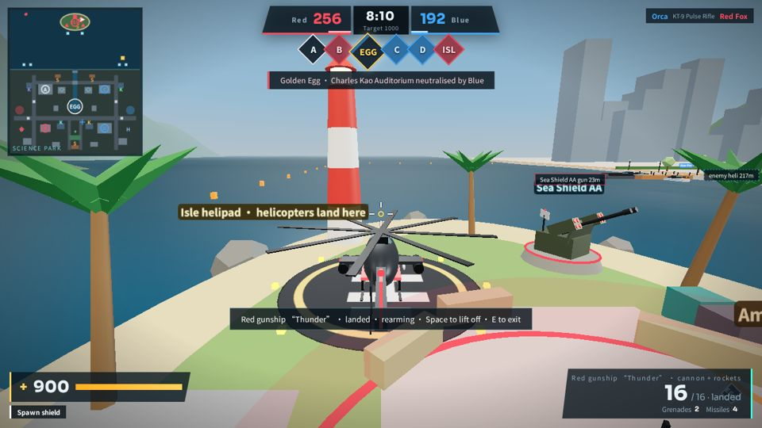

# 金蛋争夺战：科学园前线 · Golden Egg Siege



> 以**香港科学园**临海园区为灵感的原创低多边形 3D 第一人称据点射击游戏。红蓝两军围绕中央「金蛋」（高锟会议中心）、四个建筑据点以及离岸的「出海岛」展开海陆空立体作战。
>
> 浏览器直接游玩 · 单人对 AI · 开局即玩、无需安装 · **简体中文 / English** 一键切换。

技术栈：**Three.js + TypeScript + Vite**，全部模型、贴图与音效均为程序化生成（基础几何 + Canvas 贴图 + Web Audio 合成），不依赖任何受版权限制的素材。

---

## 目录

1. [快速开始](#快速开始)
2. [游戏截图](#游戏截图)
3. [核心玩法与胜负规则](#核心玩法与胜负规则)
4. [战场地图](#战场地图)
5. [作战模式](#作战模式)
6. [资源点：补给 / 技能 / 回血](#资源点补给--技能--回血)
7. [单兵武器](#单兵武器)
8. [载具与空中力量](#载具与空中力量)
9. [出海岛武器平台](#出海岛武器平台)
10. [AI 机器人](#ai-机器人)
11. [选项与难度](#选项与难度)
12. [完整操作说明](#完整操作说明)
13. [界面（HUD）说明](#界面hud说明)
14. [项目结构](#项目结构)
15. [开发、构建与测试](#开发构建与测试)
16. [调参指南](#调参指南)
17. [版本历史](#版本历史)
18. [版权与素材说明](#版权与素材说明)

---

## 快速开始

```bash
pnpm install
PORT=3000 HOST=0.0.0.0 pnpm dev     # 开发服务器 http://localhost:3000
pnpm build                          # 生产构建 → dist/
pnpm test                           # 单元测试（vitest）
```

打开页面后：

1. 标题页右侧为**任务简报**（默认展开，可点「最小化」收起）。
2. 在「作战选项」中选择**模式 / 每队人数 / 难度 / 语言**。
3. 点击「开始作战」，鼠标被锁定后即进入第一人称战斗。按 `Esc` 暂停并释放鼠标。

推荐桌面浏览器（Chrome / Edge / Firefox / Safari 最新版），窗口缩放自适应。

---

## 游戏截图

| 标题与简报 | 园区巷战 | 金蛋广场 |
|---|---|---|
|  |  |  |

| 轻型战车 | 无人机侦察 | 出海岛防空炮 |
|---|---|---|
|  |  |  |

| 远程火箭炮 | 飞鱼登陆艇载员 | 武装直升机 |
|---|---|---|
|  |  |  |



---

## 核心玩法与胜负规则

- 阵营：**红方 · 赤焰** vs **蓝方 · 海鹰**。玩家属于红方，其余队友与敌人均为 AI。
- 据点：A / B / C / D 四个建筑据点 + 中央 **金蛋**（出海模式额外增加 **出海岛 ISL**）。
- 占领：站在据点圈内持续推进进度条，最多 3 人叠加加速；敌我同时在圈内为「争夺中」，进度冻结；无人时缓慢衰减。金蛋占领速度较慢。

| 每秒得分 | 数值 |
|---|---|
| 每个建筑据点 | +1 |
| 金蛋 | +2 |
| 出海岛 | +1 |
| 每次击杀 | +2 |

**三种获胜方式（任一达成即胜）：**

1. 团队积分率先达到 **1000 分**；
2. 占领金蛋并**连续守住 120 秒**（顶部显示守蛋进度）；
3. 10 分钟时间耗尽时积分领先。

结束后显示结算面板（双方积分、击杀、个人战绩），可「再来一局」或返回标题；战绩（胜场、场次、最高击杀）保存在本地。

---

## 战场地图

整张地图以科学园临海园区为原型进行原创重构：

- **金蛋（高锟会议中心）**：地图中心的金色蛋形建筑，下方是**金蛋湖**，经**水道**与大海相连，水道上有两座桥。快艇和巡逻艇可直接驶入湖中登陆金蛋。
- **建筑群**：5E、10W、InnoCell、创科体验馆、大展览厅、机器人技术促进中心等玻璃科技楼，形成巷战、广场、连桥、屋顶与室内外切换。
- **海滨长廊与码头**：南侧海岸线与两侧码头，是侧翼与登陆路线。
- **屋顶无人机坪**：特定楼顶的起降点，可启动无人机侦察。
- **停机坪**：双方部署区附近的直升机坪。
- **出海岛**（出海模式）：离岸约 **100 米** 的小岛，有灯塔、棕榈、掩体、码头栈桥、停机坪、弹药库与武器平台。海域范围为标准模式的 **1.5 倍**，边界由浮标标出。
- 远景：起伏山脊与城市天际线，海面有实时波浪。

---

## 作战模式

### 标准模式
园区内争夺 A–D 四个据点与金蛋，可使用战车、快艇、无人机与运输直升机。

### 出海模式（标题页可选）
在标准模式基础上增加完整的海上战场：

1. **抢滩夺岛**：双方乘快艇 / 登陆艇 / 直升机争夺出海岛（第 6 个据点 ISL）。
2. **岛屿奖励**（占岛方获得）：
   - 两门 **海盾防空炮**：打击直升机与无人机，也能平射攻击船只与地面；
   - **潮汐远程火箭炮**：10 连齐射大范围轰炸科学园；
   - **巡逻艇**：从岛上经水道直达金蛋湖，突袭金蛋；
   - **出海岛重生点**：阵亡后可按 `2` 选择在岛上重生；
   - **岛上弹药库**：快速补满步枪弹药与导弹；
   - **出海岛停机坪**：武装直升机在此修理并补满火箭。
3. **海空立体作战**：飞鱼高速登陆艇可载 5 名步兵；红蓝双方各有一架可驾驶的武装直升机；运输直升机可降落在出海岛。
4. 岛上武器被摧毁后会自动修复；所有武器（步枪、手枪、手雷、导弹、机炮、火箭）都可以攻击船只。

---

## 资源点：补给 / 技能 / 回血

| 类型 | 原型 | 效果 |
|---|---|---|
| **补给点** | 园区餐厅 | 补充步枪备弹 +90、手雷 +2、导弹 +2；冷却 20 秒 |
| **技能点** | 科技公司 / 实验室 | 不同科技楼提供不同的 22 秒短时能力：疾行（冲刺强化）、护盾（60 点）、雷达扫描、稳定器（降低后坐力）；冷却 40 秒 |
| **回血点** | 会所 | 在范围内每秒恢复 24 生命 |
| **部署区** | 双方基地 | 每秒恢复 30 生命并补给弹药 |
| **岛上弹药库** | 出海岛 | 快速补满步枪与导弹（出海模式，占岛方可用） |

步枪弹药耗尽时会**自动切换为手枪**，并在 HUD 中提示**最近补给点的名称、方向与距离**。

---

## 单兵武器

| 武器 | 按键 | 弹匣 / 备弹 | 伤害 | 说明 |
|---|---|---|---|---|
| **KT-9 脉冲步枪** | `1` | 30 / 150（上限 210） | 25（爆头 ×2.1） | 620 发/分，换弹 2.1 秒；移动、空中扩散增大；右键机瞄 |
| **P-7 手枪** | `2` | 12 / **无限** | 19（爆头 ×2.2） | 备弹无限但**必须换弹**（1.35 秒），步枪打空时的保底武器 |
| **飞鱼-2 便携导弹** | `3` | 3（上限 5） | 爆炸 120，直击 +240 | 可打击步兵、战车、船只、直升机、无人机与岛上武器；右键对准载具 / 飞行器持续 0.8 秒**锁定**，发射后自动追踪 |
| **手雷** | `G` | 开局 2（上限 4） | 115（半径 7.5 米） | 2.2 秒引信，抛物线投掷 |

`Q` 依次循环切换武器。

---

## 载具与空中力量

| 载具 | 位置 | 耐久 | 极速 | 特点 |
|---|---|---|---|---|
| **轻型战车** | 园区道路 | 480 | 24 m/s | 车载机枪；可撞击敌人（140 伤害）；不能下水 |
| **登陆快艇** | 两侧码头 | 300 | 30 m/s | 船首机枪；只能在海域 / 水道 / 金蛋湖航行 |
| **飞鱼高速登陆艇**（出海模式） | 码头尽头 | 560 | 38 m/s | 驾驶员 + **5 名步兵**；停靠码头时附近友军自动登艇，靠岸按 `E` 全员登陆；艇毁时乘员落水受伤 |
| **巡逻艇**（出海模式） | 出海岛栈桥 | 300 | 30 m/s | 占岛方专属，经水道直达金蛋湖 |
| **运输直升机** | 停机坪 | 700 | 28 m/s | 按 `E` 登机后选目的地 `1–5`（各据点 / 金蛋），出海模式可选 `6` = **降落出海岛**；到达后跳伞或着陆下机，随后在附近环绕提供 16 秒火力支援 |
| **雷鸣武装直升机**（出海模式） | 部署区旁 | 900 | 34 m/s | **可驾驶**：机炮（24 伤害，射程 320 米）+ 16 发火箭弹（150 伤害，半径 6 米）；可降落在出海岛停机坪修理补给；AI 会定时出击 |
| **无人机** | 屋顶无人机坪 | 80 | 26 m/s | 15 秒俯视侦察，自动标记 42 米内敌人 20 秒；侦察中可按 `1–5` 呼叫直升机支援，出海模式占岛时按 `B` 呼叫远程火箭炮 |

无人驾驶、闲置且远离出生点的载具会自动回到码头 / 车位；被摧毁的载具一段时间后重生。

---

## 出海岛武器平台

### 海盾防空炮 ×2
- **瞄准模式**：手动高炮，射速快，近炸引信，对飞行器 26 伤害，对地面 / 船只 24 伤害，射程 300 米。
- **锁定模式**（按 `F` 切换）：雷达锁定防空导弹，对准目标 1 秒后锁定，导弹 380 伤害，装填 4.5 秒。
- 无人操作时自动防空（170 米内）。可被摧毁，45 秒后自动修复。

### 潮汐远程火箭炮
- 进入后以俯视地图操控准星（射程 340 米，可覆盖整个科学园），左键发射 **10 连齐射**，散布半径 13 米，每发 105 伤害。
- 冷却 32 秒；落点有**红圈预警**，AI 会主动规避。
- 也可在无人机侦察中按 `B` 远程呼叫。

---

## AI 机器人

- **角色分工**：进攻、防守、游走；出海模式中还有**海军陆战队**角色，负责乘船 / 登陆艇抢滩夺岛。
- **行为**：基于 A* 八方向寻路网格（含码头、桥面、岛屿连通区域）移动；视野感知、追击、连发射击、争夺据点、使用便携导弹打击载具与飞行器、操作岛上武器、规避炮击红圈。
- **空中 AI**：敌方会呼叫运输直升机支援、派出侦察无人机标记玩家；武装直升机按周期出击夺岛 / 争金蛋，血量低时返航，在己方停机坪修理补给。
- **载具 AI**：驾驶战车、快艇、巡逻艇与登陆艇；登陆艇驾驶员会在码头等待队友登艇后出发。

---

## 选项与难度

| 选项 | 取值 |
|---|---|
| 作战模式 | 标准 / 出海 |
| 每队人数 | 2–10（默认 6） |
| 难度 | 新兵 / 老兵 / 精英 / 传奇 |
| 语言 | 简体中文 / English（标题页、设置、暂停菜单右上角，3D 场景中的标牌同步切换） |
| 设置 | 音乐 / 音效音量、静音、鼠标灵敏度、Y 轴反转、画质（低 / 中 / 高） |

| 难度 | 反应时间 (秒) | 枪口散布 | 单发伤害 | 视野 (米) |
|---|---|---|---|---|
| 新兵 | 0.65–1.2 | 0.050 | 7 | 55 |
| 老兵 | 0.35–0.75 | 0.030 | 10 | 70 |
| 精英 | 0.22–0.5 | 0.022 | 12 | 80 |
| 传奇 | 0.12–0.3 | 0.016 | 14 | 92 |

难度越高，AI 发射导弹、呼叫炮击与直升机的频率也越高。

---

## 完整操作说明

| 操作 | 按键 |
|---|---|
| 移动 / 驾驶 | `W` `A` `S` `D` |
| 视角 / 瞄准 | 鼠标 |
| 射击 | 鼠标左键 |
| 机瞄 / 导弹锁定 / 武装直升机火箭 | 鼠标右键 |
| 换弹 | `R` |
| 冲刺 | `Shift` |
| 跳跃 / 武装直升机爬升 | `空格` |
| 蹲伏 / 武装直升机下降 | `C` / `Ctrl` |
| 切换武器 | `Q`（循环）或 `1` 步枪 · `2` 手枪 · `3` 导弹 |
| 手雷 | `G` |
| 交互（上下载具、武器平台、无人机、直升机） | `E` |
| 防空炮 瞄准 / 锁定 切换 | `F` |
| 无人机中呼叫远程火箭炮 | `B` |
| 直升机目的地 / 支援目标 | `1`–`5`（出海模式 `6` = 出海岛） |
| 阵亡后选择出海岛重生 | `2` |
| 战况面板 | `Tab` |
| 暂停 | `Esc` / `P` |

---

## 界面（HUD）说明

- **顶部**：双方积分、剩余时间、目标分数；各据点状态菱形（颜色 = 归属，闪烁 = 争夺中）；金蛋守蛋进度条。
- **左上**：小地图（据点、资源点、载具、直升机、队友、被标记的敌人；出海模式自动扩展显示海域与出海岛）。
- **左下**：生命值、护盾与当前增益（部署保护、技能剩余时间）。
- **右下**：当前武器、弹匣 / 备弹、手雷与导弹数量；驾驶时显示载具名称、速度与耐久。步枪弹药不足时显示**补给提示**（最近补给点名称与距离）。
- **中央**：准星、命中反馈、受击方向指示、交互提示、占领进度、导弹锁定框。
- **场景内**：据点 / 资源点 / 武器平台的双语悬浮标牌（镜头靠近时自动淡出），敌我标记与边缘方位指示。

---

## 项目结构

```
eggsiege/
├── index.html                 # 入口 HTML
├── public/
│   ├── cover.jpg              # 标题页背景与分享封面
│   └── fonts/                 # 字体子集（SIL OFL 1.1）
├── assets/share/              # 分享图标与 OG 图
├── game-sharing.json          # 分享元数据
├── src/
│   ├── main.ts                # 启动：字体、存档、界面动作、指针锁、主循环、测试钩子
│   ├── styles/main.css        # 军事科技风格界面与响应式布局
│   ├── engine/
│   │   ├── renderer.ts        # WebGL 渲染器、阴影、画质档位
│   │   ├── input.ts           # 键鼠输入、指针锁定与回退
│   │   ├── audio.ts           # Web Audio 合成音效与战斗音乐
│   │   ├── loop.ts            # 固定步长主循环
│   │   └── save.ts            # 本地存档（设置、选项、战绩，版本迁移）
│   ├── game/
│   │   ├── config.ts          # 全部可调参数与难度表
│   │   ├── rules.ts           # 纯逻辑：占领、计分、胜负（可扩展多阵营）
│   │   ├── map.ts             # 地图布局数据（据点、楼栋、码头、海域、岛屿、湖泊）
│   │   ├── world.ts           # 世界构建：建筑、金蛋、海面、湖泊水道、岛屿、标牌、静态网格合并
│   │   ├── collide.ts         # AABB 碰撞、地面高度、射线检测
│   │   ├── nav.ts             # A* 寻路网格与连通区域
│   │   ├── game.ts            # 游戏主控：对局流程、射击伤害、载具 / 飞行器交互、相机、HUD 数据
│   │   ├── player.ts          # 玩家移动物理、武器状态、后坐力、第一人称枪模
│   │   ├── bots.ts            # AI 机器人
│   │   ├── vehicles.ts        # 战车、快艇、巡逻艇、登陆艇
│   │   ├── heli.ts            # 运输直升机
│   │   ├── gunship.ts         # 武装直升机
│   │   ├── drone.ts           # 侦察无人机（玩家与 AI）
│   │   ├── emplace.ts         # 岛上防空炮与远程火箭炮
│   │   ├── ordnance.ts        # 导弹 / 防空导弹 / 火箭弹飞行与制导
│   │   ├── soldier.ts         # 低多边形士兵模型与动画
│   │   ├── fx.ts              # 曳光、火花、爆炸、烟雾、水花
│   │   ├── textures.ts        # 程序化 Canvas 贴图
│   │   ├── units.ts           # 单位公共类型与命中判定
│   │   └── i18n.ts            # 中英双语 L('中文', 'English')
│   └── ui/ui.ts               # 标题简报、选项、HUD、小地图、暂停、结算
├── tests/                     # vitest 单元测试（规则、存档）与预览测试
├── scripts/
│   ├── smoke.mjs              # Playwright 端到端冒烟测试
│   ├── debug.mjs              # 调试脚本运行器（执行步骤并截图）
│   └── check-size.mjs         # 构建体积检查
└── docs/screens/              # README 截图
```

---

## 开发、构建与测试

```bash
pnpm dev                       # 开发服务器（Vite HMR）
pnpm build                     # 类型检查 + 生产构建 + 分享资源处理 → dist/
pnpm test                      # vitest：占领 / 争夺 / 计分 / 三种胜利方式 / 存档迁移
npx tsc --noEmit -p .          # 仅类型检查
```

### 端到端冒烟测试

```bash
pnpm build && node scripts/smoke.mjs                      # 测试 dist/
SMOKE_URL=http://localhost:3000/ node scripts/smoke.mjs   # 测试开发服务器
```

需要 Playwright Chromium（`npx playwright install chromium`）。脚本自动截图到 `shots/`，覆盖：

- 标题页、简报最小化 / 展开、开始与指针锁定；
- 移动、射击、换弹、占领、补给、技能、回血；
- 战车、快艇、无人机侦察、运输直升机；
- 暂停 / 继续、对局结算与重新开始、跨局计时器回归；
- 英文界面、出海模式、防空炮瞄准与锁定、远程火箭炮齐射、便携导弹锁定打击、出海岛重生；
- 步枪耗尽自动切手枪、手枪换弹、弹药告警与岛上弹药库；
- 登陆艇载员、武装直升机起飞射击与降落出海岛、运输直升机降落出海岛；
- 小窗口响应式布局。

### 调试钩子

开发与测试时可在控制台访问 `window.__game`（`game`、`input`、`ui`、`map`、`start()`），例如 `__game.game.debugTeleport(x, z, y)`。

---

## 调参指南

所有数值集中在 [`src/game/config.ts`](src/game/config.ts)：

- `match`：时长、目标分、守蛋时间、各据点每秒得分；
- `capture`：占领速度、叠加人数、衰减；
- `player` / `weapon` / `pistol` / `launcher` / `grenade`：移动与武器手感；
- `car` / `boat` / `lander` / `gunship` / `heli` / `drone` / `scout`：载具与飞行器；
- `aa` / `artillery`：岛上武器平台；
- `DIFFICULTY`：四档 AI 难度。

地图坐标在 [`src/game/map.ts`](src/game/map.ts)；新增界面文本请使用 `L('中文', 'English')` 以保持双语。

---

## 版本历史

| 版本 | 内容 |
|---|---|
| v1 | 首个完整可玩版本：科学园战场、金蛋与四据点、补给 / 技能 / 回血、战车、快艇、无人机、运输直升机、AI 对战、结算与重开 |
| v2 | 出海模式：出海岛、金蛋湖与水道、海盾防空炮（瞄准 / 锁定）、潮汐远程火箭炮、便携导弹；人数与难度选项；中英切换；新封面 |
| v3 | 修复跨局射击计时器残留导致无法开火；新增 P-7 手枪（无限备弹需换弹）、步枪耗尽自动切换与最近补给提示、出海岛弹药库；任务简报可最小化 |
| v4 | 飞鱼高速登陆艇（载 5 人）、可驾驶的雷鸣武装直升机、直升机降落出海岛；出海岛离岸距离加倍、海域扩大 1.5 倍；近距离标牌淡出 |

---

## 版权与素材说明

- 本游戏为原创作品，地图仅以香港科学园的公开建筑布局为灵感进行风格化重构，与香港科技园公司无任何关联，亦非官方产品。
- 未使用任何现有游戏的商标、角色、模型或素材。所有 3D 模型、贴图与音效均由代码程序化生成。
- 字体子集遵循 SIL Open Font License 1.1，许可证见 `public/fonts/*-OFL.txt`。
